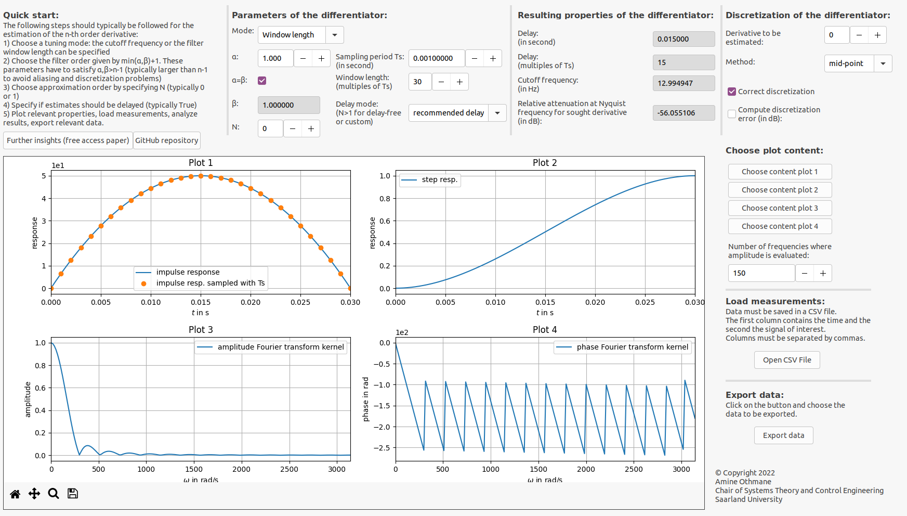

GUI
===

Since Version 1.1 a GUI is provided. Executable files for Linux and
Windows operating systems are provided and do not require the
installation of additional software. Neither Python not Matlab have to
be installed to start designing algebraic differentiators, get discrete
filter coefficients, and estimate derivatives. This GUI can be used to
plot relevant data (impulse and step responses, amplitude and phase
spectra, estimated derivatives, …), display relevant properties of the
differentiators (estimation delay, cutoff frequency, window length,
discretization effects, …), and load measured signals for the estimation
of their derivatives without a single line of code. Relevant properties,
signals, spectra, and discrete filter coefficients can be exported for
further processing.

   Figure 5. GUI for the interactive design, analysis, and use of algebraic differentiators.
