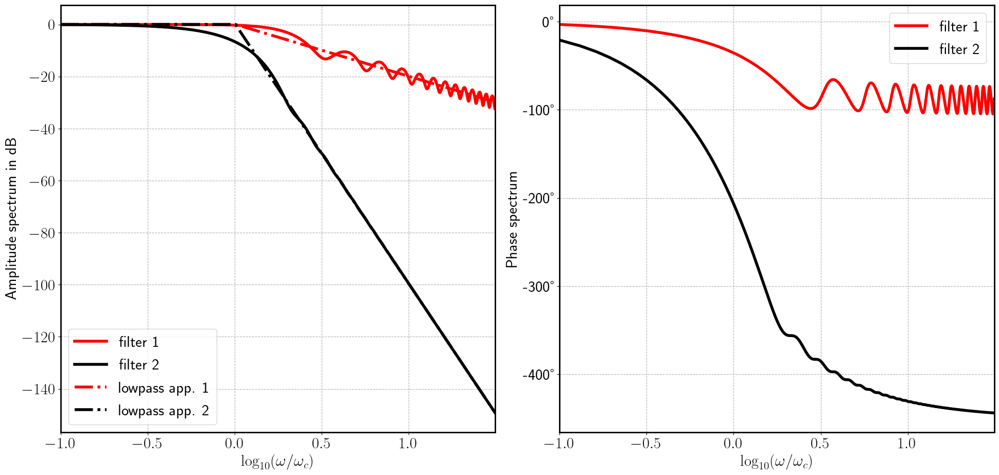

On algebraic differentiators
============================

Algebraic differentiators have been derived and discussed in the systems
and control theory community. The initial works based on
differential-algebraic methods have been developed by Mboup, Join, and
Fliess in `[2] <#2>`__. These numerical, non-asymptotic approximation
approaches for higher-order derivatives of noisy signals are well suited
for real-time embedded systems. A historical overview and a detailed
discussion of these differentiators and their time-domain and
frequency-domain properties are given in the survey `[1] <#1>`__.

The approximation-theoretic derivation recalled in the survey
`[1] <#1>`__ permits the interpretation of the estimation process by the
following three steps illustrated in the figure below stemming from
`[1] <#1>`__:

1. Projection: At time :math:`t`, the sough :math:`n`-th order time derivative :math:`y^{(n)}` over the
   interval :math:`I_T(t)` is projected onto the space of polynomials of degree :math:`N`. This
   yields the polynomial :math:`p_N` depicted in the left and middle part of Figure
   2.
2. Evaluation: The polynomial :math:`p_N` is evaluated at :math:`t-\delta_t`, which gives an estimate :math:`\hat{y}^{(n)}(t)=p_N(t-\delta_t)`
   for the derivative :math:`y^{(n)}` as depicted in the central part of Figure 2.
   Choosing the delay to be the largest root of a special Jacobi
   polynomial increases the approximation order by 1 with a minimal
   delay. Alternatively, a delay-free estimation or even a prediction of
   the future derivative might be selected, at the cost of a reduced
   accuracy.
3. Repetition: The first two steps are repeated at each discrete time
   instant while keeping the parameters of the differentiator constant.
   This yields the estimate :math:`\hat{y}^{(n)}` depicted in the right part of the Figure 2.

.. figure:: interpretationDifferentiators.png
   :scale: 80 %
   :alt: Three-step process of the estimation

   Figure 2. Three-step process of the estimation of the :math:`n`-th order derivative :math:`y^{(n)}\mapsto y^{(n)}(t)` of a signal :math:`y\mapsto y(t)` using algebraic differentiators (figure from `[1] <#1>`__)
   
Algebraic differentiators can be interpreted as linear time-invariant
filters with a finite-duration impulse response. Figure 3 visualizes the
online estimation process of the first derivative of a noisy signal. The
filter window, the buffered signal, and the filter kernel can be clearly
seen.

.. figure:: animationEstimation.gif
   :scale: 50 %
   :alt: Visualization of the online estimation

   Figure 3. Visualization of the online estimation of the first derivative a noisy signal using an algebraic differentiator. 
   
These filters can be approximated as lowpass filters with a known cutoff
frequency and a stopband slope. Figure 4 presents the amplitude and
phase spectra of two exemplary filters. The lowpass approximation is
also shown.

   Figure 4. Amplitude and phase spectra of two different filters and the corresponding lowpass approximation of the amplitude spectrum. 
   
   
See `[1] <#1>`__, `[3] <#3>`__, `[4] <#4>`__, and `[5] <#5>`__ for more
details on the parametrization of these differentiators.

